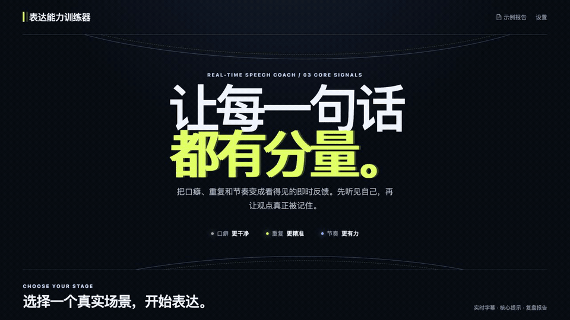

<div align="center">
  

  # 表达能力训练器 · Speech Trainer

  **别等说完，才发现自己一直在重复。**

  本地优先的中文表达训练器：在你说话时标出口头禅、连续重复、重复意思与节奏问题，训练后生成有原话证据的场景化报告。

  [快速开始](#快速开始) · [核心能力](#它会在什么时候提醒你) · [训练场景](#为三种真实场景而设计) · [工作原理](#工作原理) · [参与贡献](#参与贡献)

  [](https://github.com/Cx1824/speech-trainer/actions/workflows/ci.yml)
  [](LICENSE)
  [](backend/pyproject.toml)
  [](frontend/package.json)
  [](#数据与隐私)
</div>



说话不是“结束后看一个分数”。Speech Trainer 尝试把真正能改的细节，在它发生时变得可见：哪个词正在反复出现，哪句话和前文意思相同，哪里停顿过久，以及下一句怎样说得更具体。

无需 API Key 也能完成训练：系统使用本地字幕、规则提示和通用训练话术，结束后保留客观表达报告，并可复制分析提示词或下载完整 Markdown 材料交给任意语言模型。场景化内容评分需要配置你自己的语言模型服务。

> 当前为 `v0.1.0` 首发候选，适合本地体验和参与开发。它是表达训练工具，不是心理、性格、医疗或招聘决策系统。

## 它会在什么时候提醒你

| 说话中发生的事 | 你会看到什么 | 训练目标 |
| --- | --- | --- |
| “就是、然后、其实”等在语境中成为口头禅 | 对应词右上角标签、下方强调线与累计次数 | 减少无意义连接词 |
| 同一个字或词组连续说多次 | 连续重复实时标记 | 识别口吃式重复，而不是误伤正常用词 |
| 后一句换了说法，但仍在表达同一件事 | 两句原话的重复意思提示 | 把重复结论换成事实、数据或动作 |
| 语速过快、停顿过久或长句失控 | 低干扰节奏提示与下一句建议 | 在不打断表达的前提下调整节奏 |

正在说的字幕占据视觉中心，历史字幕自动退后；AI 面试官提问和思考状态只在需要时出现，不长期挤占字幕空间。训练结束后，实时信号会进入可追溯的场景报告，而不是只留下一个无法解释的总分。

## 为三种真实场景而设计

| 场景 | 适合练什么 | 场景化评价 |
| --- | --- | --- |
| **模拟面试** | HR 面、专业面、全流程；自我介绍、项目深挖、岗位问题与反问 | 回答结构、岗位匹配、表达流畅度 |
| **工作汇报** | 结论先行、数据支撑、时间控制与质询应对 | 结论与结构、数据与论据、时间控制 |
| **演讲训练** | 限时表达、核心观点、声音与节奏 | 演讲结构、观点表达、声音与节奏 |

三个场景共享同一套语音与文本事实，但使用不同的评价维度。面试、汇报和演讲不是换一段提示词，也不应该用同一把尺子打分。

## 快速开始

### 环境要求

- Python 3.11+
- Node.js 20.19+ 或 22.12+
- npm

### 1. 启动后端

```bash
cd backend
python3 -m venv .venv
source .venv/bin/activate
pip install -e ".[dev]"
python scripts/install_local_asr.py
cp .env.example .env
uvicorn app.main:app --host 127.0.0.1 --port 8000
```

> Windows PowerShell 请将激活命令换成 `.\.venv\Scripts\Activate.ps1`，并按本机环境使用 `python` 或 `py -3.12`。

### 2. 启动前端

另开一个终端：

```bash
cd frontend
npm ci
npm run dev
```

打开 <http://localhost:5178>。后端健康检查：

```bash
curl http://127.0.0.1:8000/api/health
```

依赖已经安装时，macOS / Linux 也可以在项目根目录直接运行：

```bash
./start.sh
```

### 3. 配置内容分析

实时字幕默认使用本地 sherpa-onnx，不需要 API Key：流式 Zipformer 持续更新字幕，停顿成句后由本地 SenseVoice 精校。首次安装会下载约 300 MB 模型压缩包，解压后约占 410 MB；模型保存在用户数据目录，不会进入 Git 仓库。

场景化内容分析需要语言模型服务。复制 `backend/.env.example` 后填写，或在本地设置页配置。仓库预填 DeepSeek 官方 API 地址和模型名，但**不包含任何 Key**；实际可用模型以 [DeepSeek 官方 API 文档](https://api-docs.deepseek.com/api/create-chat-completion/) 为准。阿里云 Paraformer 等可选语音服务也可在设置页切换。

不配置内容模型时，面试、工作汇报和演讲会使用本地通用话术继续训练，报告保留语速、停顿、口头禅、重复和完整对话，但不伪造语义维度分数。报告页可以复制一份模型无关的分析提示词，也可以下载包含训练记录、本地信号和评价标准的 Markdown 材料。示例人物、对话和分数均为虚构演示数据。

## 工作原理

```text
麦克风
  └─→ 本地实时转写 ─→ 字幕与低干扰提示 ─→ 表达 / 节奏事实 ─→ 本地保存
                                                  │
                         ┌────────────────────────┼────────────────────────┐
                         ↓                        ↓                        ↓
                    面试评价                 工作汇报评价               演讲评价
                         └────────────────────────┼────────────────────────┘
                                                  ↓
                                      有原话依据的场景化报告
```

共享事实层和场景评价层刻意分开：语速、停顿、口头禅和重复等观察事实不会因为场景而改变；它们在不同沟通任务中的重要程度可以不同。

## 为什么报告不是一个黑盒分数

- **事实先于判断**：语速、停顿、口头禅、重复和长句展示可读依据。
- **建议引用原话**：生成式评价需要引用训练原话或明确事实。
- **缺数据就说明缺数据**：没有有效发言、声音片段或语义评价时，不补默认分数。
- **不推断心理状态**：声音波动只作为实验事实，不等同于紧张、自信或稳定性。
- **场景分数不横向比较**：三类任务的评价标准不同，总分不代表同一种能力。

项目已公开首轮 24 条真人普通话样本和 4 条同文对照的评测方法、来源元数据、派生结果与失败案例；原始音频不随仓库分发。三场景自发口语仍需要继续扩充验证。

## 数据与隐私

“本地优先”不等于所有功能都完全离线：

- 会话、材料解析结果、声音基线和运行配置默认保存在 `backend/data/`。
- 上传材料默认保存在 `backend/uploads/`。
- 使用默认本地语音识别时，训练音频不会上传。
- 切换云端 ASR、TTS 或 LLM 后，对应音频、文本或提示内容会发送给所选服务商。
- 后端默认只监听 `127.0.0.1`；当前发布范围不包含公网部署、多用户认证或云端数据隔离。

公开 Issue 或截图前，请先删除数据库、录音、简历、报告、日志和 API Key 等个人信息。安全问题请按 [安全政策](SECURITY.md) 私下报告。

## 当前限制

- 首次使用本地字幕需要另行下载语音模型；仓库与公开 Release 不分发模型权重。
- 内容结构、场景评价和生成式建议依赖外部 LLM。
- 默认本地识别主要面向普通话，方言、混合语言和嘈杂环境仍需更多验证。
- 声音、节奏和文本指标是训练用启发式信号，不应用于招聘、心理或医疗判断。
- Windows 10/11 x64 的首次启动、训练与报告链路已实机验证；公开版目前仍以源代码方式分发。

## 技术栈

- 前端：React 18、TypeScript、Vite、Ant Design
- 后端：Python、FastAPI、WebSocket、SQLAlchemy
- 存储：SQLite
- 本地字幕：sherpa-onnx Zipformer + SenseVoice
- 可选 AI：可配置的 ASR / TTS / OpenAI-compatible LLM Provider

<details>
<summary><strong>开发、测试与发布检查</strong></summary>

后端：

```bash
cd backend
pytest -q
python -m pip_audit
```

前端：

```bash
cd frontend
npm run lint
npm run build
npm run test:live-filler
npm run test:resampler
npm audit --omit=dev
```

发布候选：

```bash
python3 scripts/check_release.py --history
```

工程与发布细节见 [一阶段开源门槛](docs/phase-1-open-source-readiness.md)、[工程规范](docs/engineering.md) 和 [GitHub 上线执行单](docs/github-launch.md)。

</details>

## 参与贡献

如果你也在意中文表达训练中的实时性、可解释性和隐私边界，欢迎参与：

- 提交可复现的字幕、提示或报告问题；
- 扩充脱敏、许可清晰的普通话评测样本；
- 改进三类场景的训练流程和评价依据；
- 完善 Windows、macOS 和 Linux 的首次使用体验。

提交改动前请阅读 [贡献指南](CONTRIBUTING.md) 与 [社区行为准则](CODE_OF_CONDUCT.md)。不要在公开 Issue 中上传完整训练音频、数据库、简历或密钥。

## 路线图

- [x] 面试、工作汇报、演讲三场景训练闭环
- [x] 本地实时字幕、句末精校与低干扰提示
- [x] 口头禅、连续重复、重复意思和节奏证据
- [x] 场景化可解释报告与固定示例报告
- [x] 无 LLM 本地模式与手动分析材料导出
- [ ] 扩充真实自发口语评测并继续校准提示频率
- [ ] 改善跨平台安装和首次模型下载体验
- [ ] 根据首批公开用户反馈打磨面试覆盖与报告建议

## License

[MIT License](LICENSE) · 第三方组件见 [THIRD_PARTY_NOTICES.md](THIRD_PARTY_NOTICES.md)。仓库不分发本地 ASR 模型权重；评测元数据、音频来源和第三方素材分别遵守其注明的许可与使用条件。

<div align="center">

如果这个项目能让你下一次表达更清楚，欢迎点一个 Star，让更多人看到它。

**Speak clearly. Make every sentence count.**

</div>
